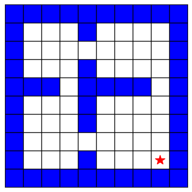
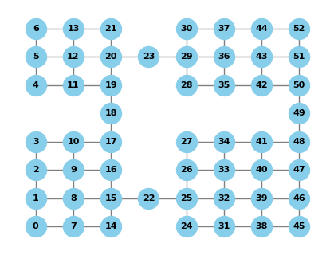
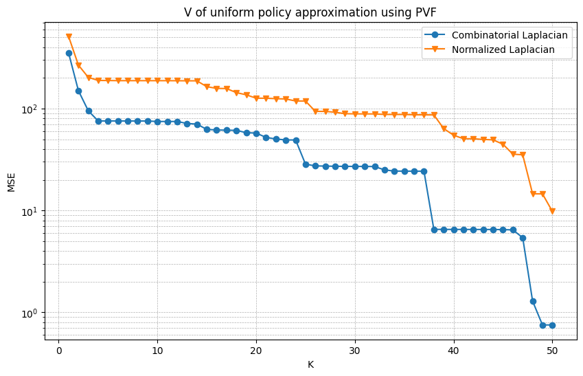
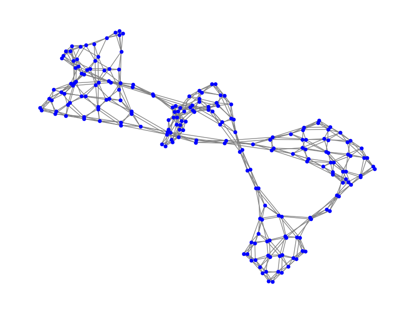
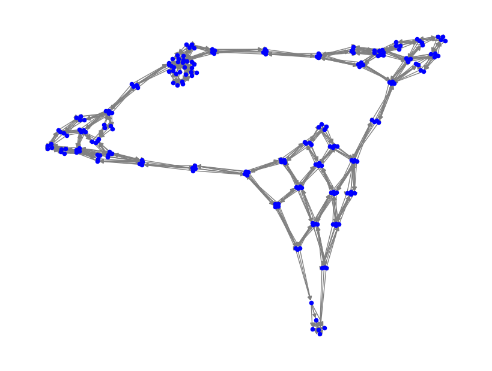

# Graph-based-exploration
This repo contains some experiments of Q function approximation using graph Laplacian-based features on Four room grid environment.
## The environment
The environment is made of 53 navigable states and 47 wall states. The possible actions are 4 (up, down, right and left), the transition from one state to another is deterministic when choosing an action. If the action leads to a wall state the agent stays still in the same state. The tile corrsponding to the goal (represented with a star in the grid) is an absorbing state.
The grid can be plotted as follows:
```python
from four_room_grid import Four_room_grid
grid = Four_room_grid()
grid.plot_grid()
```


## State-graph
To state-graph is the graph where each node is a state. The edge from one state to another exists if there exists an action that, if performed from the first state, has probability > 0 of reaching the second state. The graph can be created and plotted as follows:
```python
from four_room_grid import Four_room_grid
grid = Four_room_grid()
g,A = grid.create_state_graph() # g is a networkx.Graph(), A is the adjacency matrix
grid.plot_state_graph()
```


The laplacian can be calculated as follows:

```python
from four_room_grid import Four_room_grid, Policy
grid = Four_room_grid()
g,A = grid.create_state_graph()
L = grid.laplacian_state() # combinatorial laplacian
norm_L = grid.normalized_laplacian_state() # normalized laplacian
```
Example of uniform policy V linear function approximation using state-graph laplacian eigenvectors:
```python
import numpy as np
from four_room_grid import Four_room_grid
import matplotlib.pyplot as plt

grid = Four_room_grid()
L = grid.laplacian_state()

norm_L = grid.normalized_laplacian_state()
U_combinatorial, _, _ = np.linalg.svd(L)
U_norm, _, _ = np.linalg.svd(norm_L)
k_vec = [k+1 for k in range(50)]
err_vec_combinatorial = []
err_vec_normalized = []
uniform_policy = Policy()
V_uniform = uniform_policy.calculate_V_pi()
for k in k_vec:
    phi = U_combinatorial[:,-k:]
    weights = np.linalg.solve(phi.T@phi, phi.T@V_uniform)
    V_predicted = phi @ weights
    err_vec_combinatorial.append(np.mean((V_predicted - V_uniform)**2))

    phi = U_norm[:,-k:]
    weights = np.linalg.solve(phi.T@phi, phi.T@V_uniform)
    V_predicted = phi @ weights
    err_vec_normalized.append(np.mean((V_predicted - V_uniform)**2))


plt.figure(figsize=(10, 6))
plt.plot(k_vec, err_vec_combinatorial, marker='o', label = 'Combinatorial Laplacian')
plt.plot(k_vec, err_vec_normalized, marker='v', label = 'Normalized Laplacian')
plt.yscale('log')
plt.title('V of uniform policy approximation using PVF')
plt.xlabel('K')
plt.ylabel('MSE')
plt.grid(True, which='both', linestyle='--', linewidth=0.5)
plt.legend()
plt.show()
```


## State-action graph
The state action graph has nodes corresponding to each state-action pair.
Two experiments in particular were performed:
  - Unweighted and undirected graph, similar to the state action graph, in this way the laplacian is calculated as usual as D-A.
  - Weighted and directed graph as in 2005, Chung, F. Laplacians and the Cheeger Inequality for Directed Graphs. and the precautions as in Osentoski, Mahadevan, 2007, Learning State-Action    Basis functions for Hierarchical MDPs (for more details check the implementation in ```four_room_grid.py```)

To plot the unweighted and undirected graph:

```python
from four_room_grid import Four_room_grid
grid = Four_room_grid()
g,A = grid.create_state_action_graph()
grid.plot_state_action_graph()
```


To plot the weighted and directed graph:
```python
from four_room_grid import Four_room_grid, Policy
grid = Four_room_grid()
uniform_policy = Policy()
grid.set_policy(uniform_policy)
G,W = grid.create_state_action_graph(weighted = True)
grid.plot_state_action_graph()
```


In ```example.ipynb``` there are some examples on the approximation of the Q function using the two different graph representations for different policies.


